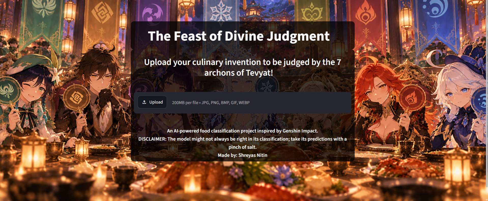
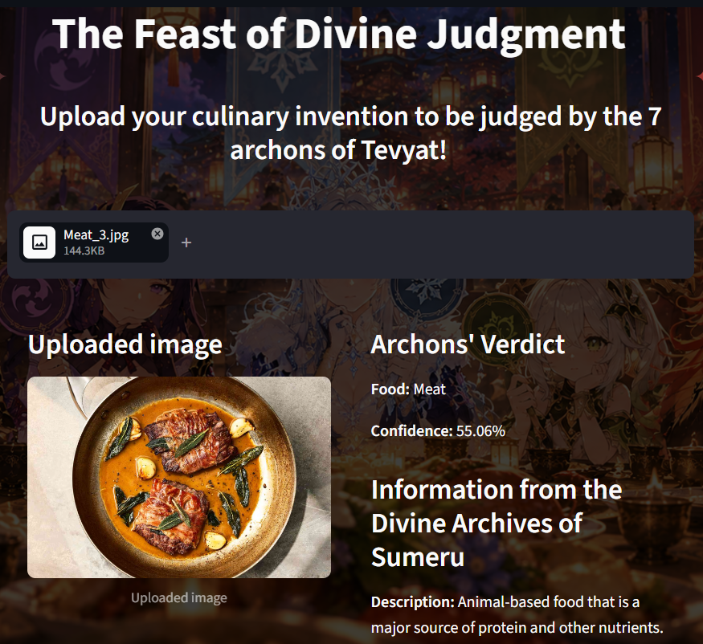
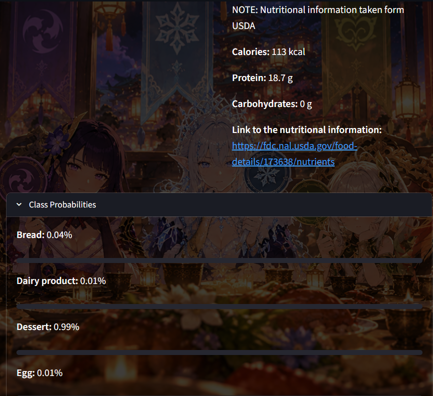
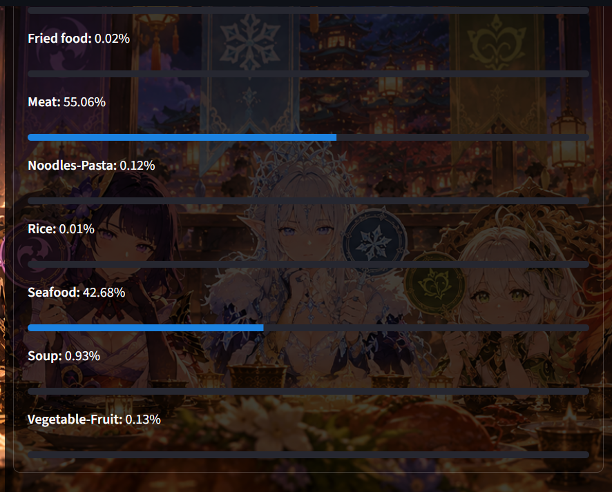

# The Feast of Divine Judgement
An AI-powered food image classification application inspired by *Genshin Impact*. Built using TensorFlow, MobileNetV2, Open-CV, Streamlit and MongoDB, the application classifies food images into 11 categories and retrieves associated nutritional information. The Feast of Divine Judgement operates on
the Food-11 dataset which is publically available. The version of the food-11 dataset used for The Feast of Divine Judgement can be accessed from here:
https://www.kaggle.com/datasets/trolukovich/food11-image-dataset
This version of the Food-11 dataset has already divided the data into train, validation and test sets. 
## Application preview
### The Archons' Verdict
Upload a culinary creation and let the Seven Archons determine its category. The application displays the predicted food class, confidence score, class probabilities, and nutritional information retrieved from MongoDB.
#### The UI without judgement

#### The UI after judgement



## Features
- **Food Image Classification:** Predicts the category of an uploaded food image using a fine-tuned MobileNetV2 model.
- **Confidence Scores:** Displays the predicted category's confidence and probabilities for all 11 classes.
- **Nutritional Information:** Retrieves food descriptions, calories, protein, carbohydrates and reference links for nutritional information from MongoDB.
- **Interactive Web Interface:** Provides an interface inspired by the world of Teyvat.
- **About and Limitations Pages:** Explains the model, supported categories and its limitations.
## Technologies used
- Python
- TensorFlow and Keras
- MobileNetV2
- Food-11 dataset
- Streamlit
- MongoDB and PyMongo
- NumPy
- Pillow
- Pandas
- Matplotlib
- OpenCV
- Scikit-learn
- python-dotenv
## Food categories
The model classifies images into 11 categories:
1. Bread
2. Dairy product
3. Dessert
4. Egg
5. Fried food
6. Meat
7. Noodles-Pasta
8. Rice
9. Seafood
10. Soup
11. Vegetable-Fruit
## Research papers and literature review
The following research papers informed the study of food image classification, transfer learning, image preprocessing, data augmentation, and model selection for this project.
### 1. Computer Vision in the Food Industry: Accurate, Real-time, and Automatic Food Recognition with Pretrained MobileNetV2
**Authors:** Shayan Rokhva, Babak Teimourpour and Amir Hossein Soltani.

This paper investigates MobileNetV2 for food recognition using the Food-11 dataset. It discusses transfer learning, data augmentation, regularization, hyperparameter tuning and the effects of image size on classification performance.

**Relevance to this project:** Provided a reference for selecting MobileNetV2 as the model architecture and investigating 256 × 256 image inputs and transfer learning techniques.

Link to their paper: https://arxiv.org/abs/2405.11621

### 2. Food Classification Using Deep Learning: Presenting a New Food Segmentation Dataset
**Authors:** Mehwash Farooqui, Atta-ur Rahman, Roaa Alorefan, Mariam Alqusser, Lubna Alzaid, Sara Alnajim, Amal Althobaiti and Mohammed Salid Ahmed.
This paper investigates food classification using MobileNetV2 and presents a food segmentation dataset intended to support food quantity estimation. The authors report an optimal classification accuracy of 93.06%.

**Relevance to this project:** Provides additional context on MobileNetV2-based food classification and the distinction between identifying food categories and estimating food quantities.

Link to their paper: https://www.iieta.org/journals/mmep/paper/10.18280/mmep.100336

## Technical report
A detailed technical report detailing the model's architecture and the key decisions taken will be accompanying this. This is currently underworks and 
would be linked as soon as its finished. 

## Project structure
```text
Food11/
├── app/
│   ├── pages/
│   │   ├── About.py
│   │   └── Limitations.py
│   ├── database.py
│   ├── insert_data.py
│   ├── Judgement.py
│   ├── Streamlit background.png
│   ├── Streamlit background2.png
│   ├── Streamlit background3.png
│   └── Streamlit background4.png
│
├── data/
│   └── raw/
│       └── Food_11/
│           ├── evaluation/
│           ├── training/
│           └── validation/
│
├── outputs/
│   ├── figures/
│   │   ├── class_distributions/
│   │   │   ├── test_set_class_distribution.png
│   │   │   ├── training_set_class_distribution.png
│   │   │   └── validation_set_class_distribution.png
│   │   ├── sample_images_from_each_class/
│   │   │   └── img_samples.png
│   │   └── training_history/
│   │       ├── training_validation_accuracy.png
│   │       └── training_validation_loss.png
│   ├── saved_model/
│   │   └── food11_mobilenetv2.keras
│   ├── test_results/
│   │   ├── classification_report.txt
│   │   ├── confusion_matrix.png
│   │   └── test_statistics.txt
│   ├── tuning_logs/
│   │   └── hyperparameter_tuning.csv
│   └── best_hyperparameters.json
│
├── screenshots/
│   ├── judgement_1.png
│   ├── judgement_2.png
│   ├── judgement_3.png
│   └── judgement_blank.png
│
├── src/
│   ├── data_loader.py
│   ├── eda.py
│   ├── hyperparameter_tuning.py
│   ├── model.py
│   ├── preprocess.py
│   ├── test.py
│   └── train.py
│
├── Test_imgs/
│   ├── Bread/
│   ├── Dairy/
│   ├── Dessert/
│   ├── Egg/
│   ├── Fried food/
│   ├── Fruit-Vegetable/
│   ├── Meat/
│   ├── Pasta/
│   ├── Rice/
│   ├── Seafood/
│   └── Soup/
│
├── .env
├── .gitignore
├── Food_11.zip
├── README.md
└── requirements.txt
```
## Model development
The classification model uses transfer learning with MobileNetV2 pretrained on ImageNet.

Key implementation decisions include:

- Image resizing to 256 × 256 pixels.
- Data augmentation using random flips, rotations, brightness and contrast adjustments, zooming, and random erasing.
- Selective fine-tuning of pretrained layers.
- Dropout and L2 regularization.
- Adam optimizer and sparse categorical cross-entropy loss.
- Early stopping based on validation loss.
- Randomized hyperparameter sampling using Scikit-learn's `ParameterSampler`.
- Macro F1-score as the primary hyperparameter selection metric.

The dataset is divided into training, validation and evaluation sets. Hyperparameter selection trains on the training set and evaluates on the validation set, while the evaluation set is reserved for final model assessment.

## Training and evaluation
The model development pipeline includes exploratory data analysis, preprocessing, hyperparameter tuning, training and evaluation.

### Exploratory Data Analysis (EDA)
The EDA pipeline examines the distribution of food categories across the training, validation and evaluation sets. It also generates sample images representing the different classes, taken from the training set.

### Preprocessing
Images are resized to 256 × 256 pixels and converted into tensors suitable for the neural network. Data augmentation is applied to the training set to introduce image variations and improve generalization.

### Hyperparameter tuning
Randomized hyperparameter sampling is performed using Scikit-learn's `ParameterSampler`. Candidate configurations are evaluated on the validation set, with macro F1-score serving as the primary selection metric.

### Model training
The selected hyperparameters are used to train the MobileNetV2-based classifier. Early stopping monitors validation loss and restores the best weights observed during training.

### Final evaluation
The final model is evaluated on the held-out evaluation set. The evaluation pipeline generates:

- Test loss and accuracy.
- Macro precision, recall, and F1-score.
- A classification report.
- A confusion matrix.
- Training and validation accuracy plots.
- Training and validation loss plots.
- Hyperparameter tuning logs and selected hyperparameters.

The evaluation set is reserved for final assessment and should not be used for hyperparameter selection.

## Results
The final test results were as follows:

- Test loss: 0.3316
- Test accuracy: 0.8990
- Test macro precision: 0.8955
- Test macro recall: 0.9185
- Test macro F1: 0.9043

## Local installation and setup
These instructions are intended for users who want to run the application locally rather than access the deployed version.
### 1. Clone the Repository

```bash
git clone The_Feast_of_Divine_Judgement
cd Food11
```

### 2. Install Dependencies

Create and activate a virtual environment:

```bash
python -m venv .venv
```

On Windows:

```powershell
.venv\Scripts\activate
```

On Linux/macOS:

```bash
source .venv/bin/activate
```

Install the required packages:

```bash
pip install -r requirements.txt
```

### 3. Configure MongoDB

The application connects to MongoDB to retrieve food descriptions and nutritional information.

The repository includes a `.env` file containing the connection configuration for the shared, read-only food database.

If you use the provided configuration, no separate database setup is required.

### 4. Run the Application Locally

From the project root, execute:

```bash
streamlit run app/Judgement.py
```

Open the local URL displayed in the terminal to use the application.
## Limitations
### 1. Limited Classification Categories

The model recognizes only the 11 categories represented in the Food-11 dataset. It cannot reliably identify individual recipes, specific dishes, or ingredients. Food images outside the supported categories may still be assigned to one of the available classes.

### 2. Image Quality and Presentation

Blurry images, poor lighting, unusual viewing angles, obstructed food items, and cluttered backgrounds may affect classification performance. Clear images with the food item prominently visible are recommended.

### 3. Prediction Confidence

The application displays the model's predicted probabilities and selects the category with the highest probability. However, a high confidence score does not guarantee a correct prediction, particularly for unfamiliar images or images that differ significantly from the training data.

### 4. Nutritional Information

The nutritional information is associated with the predicted food category and may not represent the exact dish, recipe, serving size, or preparation method. The application does not calculate the actual nutritional content of the uploaded image.

### 5. Ingredient and Food Safety Limitations

The application does not identify individual ingredients, detect allergens, verify food safety, or determine whether a dish is suitable for a specific dietary requirement. Its outputs should not be used for medical or food-safety decisions.

### 6. Generalization

The model's performance depends on the examples and variations represented in the Food-11 dataset. Differences in cuisine, food presentation, lighting, and image quality may affect its ability to classify new images correctly.

This application is intended for educational and demonstration purposes. Its predictions and nutritional records should not be treated as medical, dietary, or food-safety advice.

## Acknowledgements

- **Food-11:** Dataset used for food image classification.
- **MobileNetV2:** Pretrained architecture used for transfer learning.
- **TensorFlow and Keras:** Deep learning framework.
- **Streamlit:** Interactive application framework.
- **MongoDB:** Database for food information.
- **USDA FoodData Central:** Source of linked nutritional reference information.

## Author
**Shreyas Nitin**

An AI-powered food classification project inspired by *Genshin Impact*.

*Present your culinary creation before the Seven Archons and await their verdict!*
